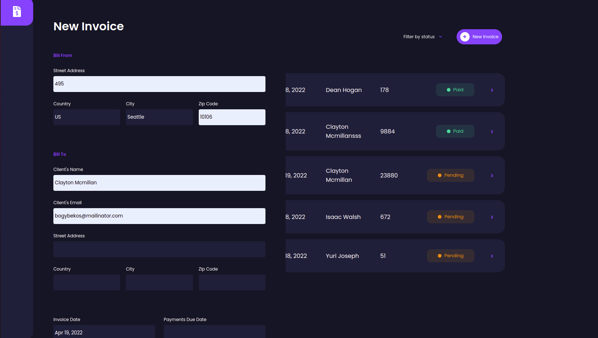

# invoice-app

simple invoice app using firebase, Reduce and Vue 3, with filters, and other cool stuff

 ##### Homepage
<p align="center">
    
</p>

##### Add Invoice
<p align="center">
    
</p>

##### Edit,View and Delete
<p align="center">
    
</p>


## Project setup
```
npm install
```

### Compiles and hot-reloads for development
```
npm run serve
```

### Compiles and minifies for production
```
npm run build
```

### Lints and fixes files
```
npm run lint
```

### Customize configuration
See [Configuration Reference](https://cli.vuejs.org/config/).
